# Healthcare Data Cleaning Project in Excel

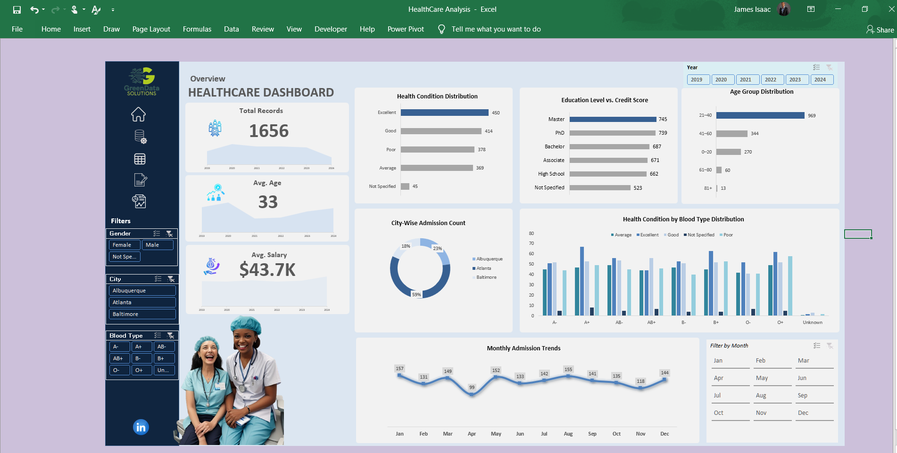
[Watch video](https://drive.google.com/file/d/1tzFeC8HvfZl9qoqpVP2bmE8xJcYgePyz/view?usp=sharing)

## Introduction
Data quality is a critical aspect of data analytics, ensuring accuracy, consistency, and reliability for meaningful insights. This project was undertaken as part of a data cleaning challenge organized by GreenData Solutions. My motivation for participating stemmed from my passion for Excel and Power Query, a desire to contribute to the analytics community, and the opportunity to engage in my first-ever data cleaning challenge.

In this project, I assumed to worked as a Data Analytics Consultant for a healthcare system, tasked with cleaning and structuring messy patient health records. The dataset contained 1,659 rows and 12 columns, with various inconsistencies such as missing values, duplicate records, formatting errors, and incorrect data entries.

Using Excel & Power Query, I systematically identified, transformed, and standardized the dataset to improve its integrity, ensuring it was ready for analysis.

## Tools Used
- Excel – For data structuring, validation, and transformation.
- Power Query – For advanced cleaning, automation, and formatting.
  
## Dataset Overview
The dataset was provided in CSV format, containing 1,659 rows and 12 columns. Below is the data dictionary for reference.

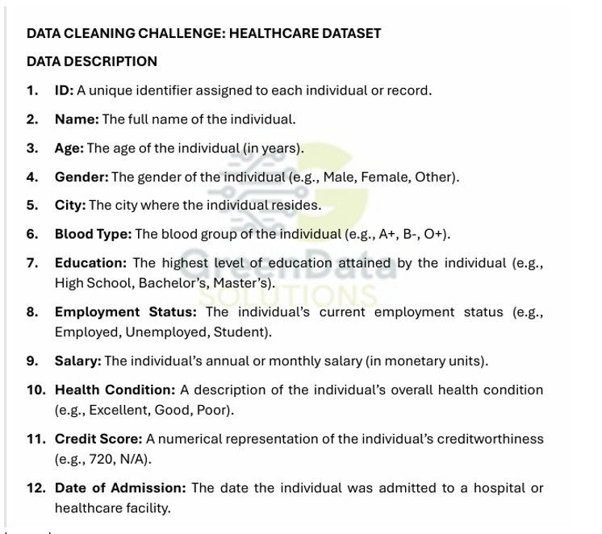

_Image 1_

Here is a snapshot of the original dirty data:

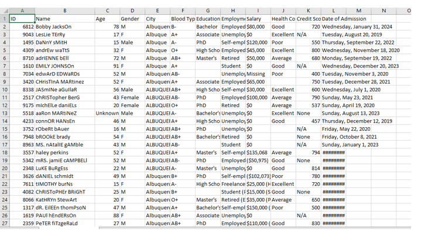

_Image 11_

## Initial Steps Before Cleaning
### Step 1: Creating a Backup of the Original Dataset
The first action taken was to duplicate the original dataset, creating a backup copy. This ensured that if errors occurred during cleaning, I could always refer back to the unaltered data.

### Step 2: Converting the Dataset into a Table
Before cleaning the data, I converted the dataset into an Excel table to gain the following benefits:

Structured Data – Tables provide a more organized format for data manipulation.
Auto-Formatting – Ensures consistent styling and formatting throughout the dataset.
Easy Filtering & Sorting – Allows quick identification of patterns and inconsistencies.
With these foundational steps completed, I proceeded with the column-wise cleaning process, which I found to be the most effective approach.

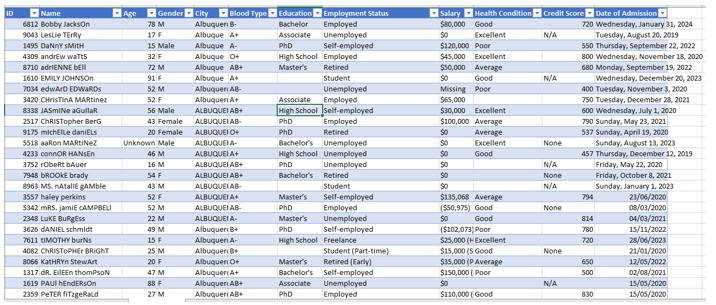

_Table Format of Dirty Data_

Note: The scope of this cleaning would be column-wise which I see to be the best technique. Therefore, I would be taking the columns one after the other

## Data Cleaning Process
### Cleaning the ID Column
According to the data dictionary, the ID column serves as a unique identifier for each patient record.

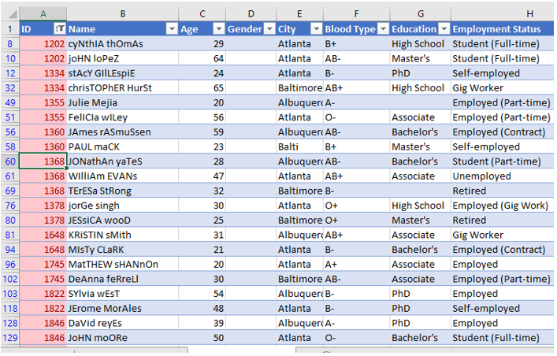

_Image 1.0_

To verify this, I checked for duplicate IDs using conditional formatting.
286 duplicate IDs were found, but further investigation showed that some had different names, ages, and other attributes, suggesting they were not true duplicates.
After properly filtering, I identified three true duplicate records, which I removed.
Based on these findings, I concluded that ID numbers were not unique to each patient in this dataset.

**BUT** we need to clean the Name column first, the format is quite ugly and can confuse Excel, leading to a bit of frustration on my part. I hate to be frustrated 😊

### Cleaning the Name Column
The Name column was poorly formatted, making it difficult to work with. The goal was to:

Convert names into Proper Case for consistency.
Split full names into First Name and Last Name for better structure.
Remove titles and suffixes (Dr., Ms, Jnr, PhD, etc.), which were unnecessary.
Trim extra spaces and merge the cleaned names.
This cleaning was performed using Power Query for efficiency.

Below are the following steps I took to clean the Name column:

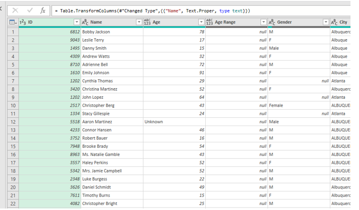

_Image 2.0- Capitalizing Name Column_

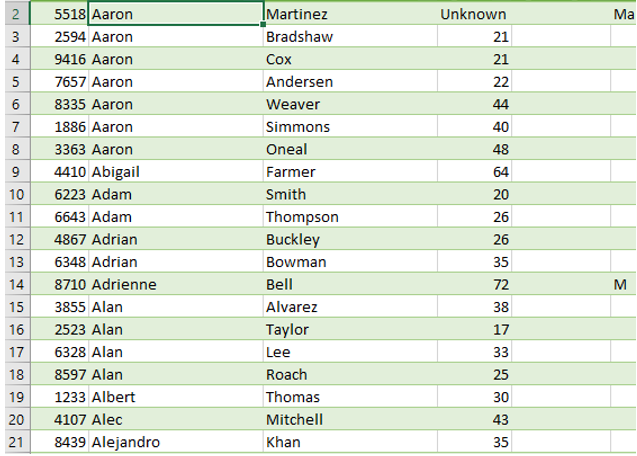

_Image 3.0- Columns splits into Firt and Last name_

### Cleaning the Education Column
The dataset contained five unique educational levels (High School, Associate, Bachelor’s, Master’s, and PhD).
Some entries had inconsistencies, which were corrected to match the standard categories.

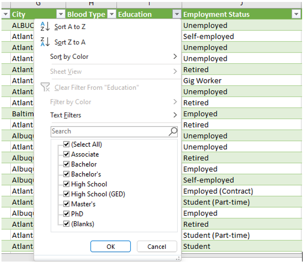

_Image 4.0_

### Cleaning the Age Column
The Age column contained unrealistic values, including ages below 10 and up to 101.
Some individuals under 10 years had advanced degrees, indicating input errors.
Since this dataset was assumed to contain U.S. citizens, I applied a minimum age of 17 (the typical U.S. high school graduation age).
To correct erroneous ages, I used the Education column as a reference and applied the following formula:

=IF([@Age]<17, IF([@Education]= "Unknown", AVERAGE([Age]),AVERAGEIFS([Age],[Education],[@Education])),[@Age])

This process ensured that implausible ages were adjusted logically while maintaining data integrity.

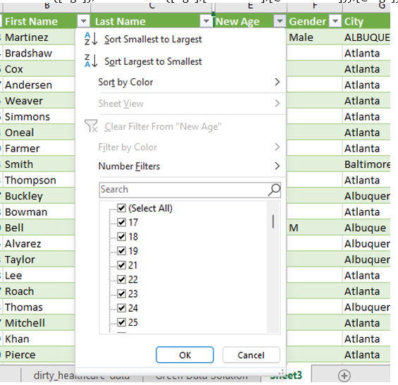

_Image 5.0_

### Cleaning the Gender Column
1,626 out of 1,659 entries were missing, meaning over 90% of the gender data was absent.
Due to the high volume of missing values, I decided to remove this column entirely. 

### Cleaning the City Column
There were three unique city names, but some entries were abbreviated.
To ensure consistency, I replaced the abbreviations with full city names.

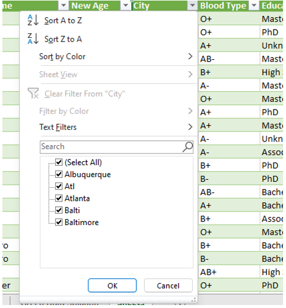

_Image 6.0_

### Cleaning the Blood Type Column
The Blood Type column contained eight missing values.
Instead of removing them, I replaced blanks with "Unknown", assuming that these individuals were unaware of their blood type.

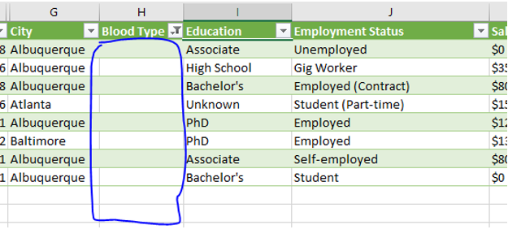

_Image 7.0_

### Cleaning the Employment Status Column
The employment status values were too granular, including extra details like "Employed (Contract)" and "Student (Part-time)".
To simplify, I grouped them into four broad categories:
- Employed
- Unemployed
- Retired
- Student
  
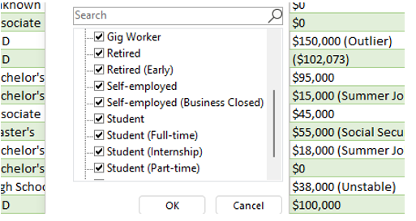

_Image 8.0_

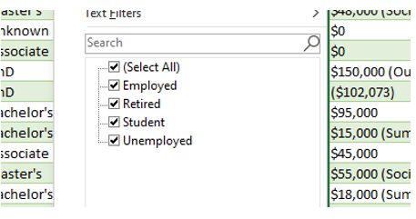

_Image 9.0_

### Cleaning the Salary Column
Some salary values included descriptions in brackets (e.g., "$50,000 (Freelance)").
I separated salary figures from income sources into distinct columns.
Any blanks in the income source column were replaced with "Unspecified".
Removed dollar signs ($) and reformatted the column as currency.

### Cleaning the Health Condition Column
The Health Condition column had missing values, which were replaced with "Unknown".
Cleaning the Credit Score Column
I corrected typos and standardized missing values by replacing "None" with "N/A".

### Cleaning the Date of Admission Column
Some values were stored as numbers, while others were text-formatted.
Using Power Query, I converted all values into date format, ensuring consistency.

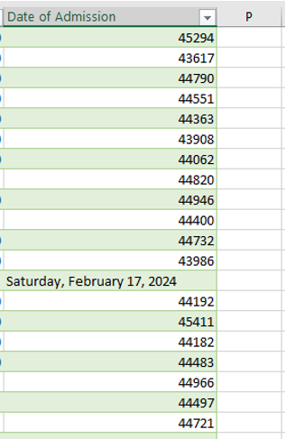

_Image 10.0_

## Final Dataset Summary
The cleaned dataset now consists of 1,656 rows and 13 columns.
All inconsistencies, missing values, and formatting issues have been resolved.
The dataset is now well-structured and ready for detailed analysis.

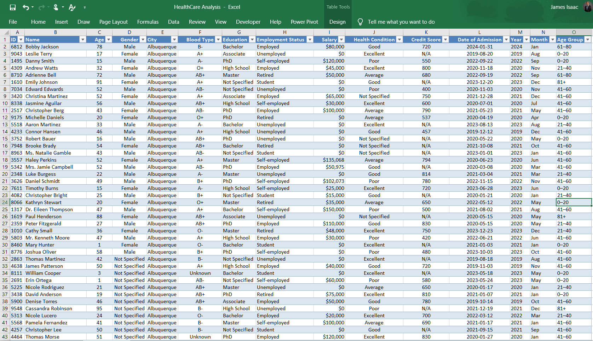

_Snapshot of the clean dataset_
[Watch video](https://drive.google.com/file/d/1tzFeC8HvfZl9qoqpVP2bmE8xJcYgePyz/view?usp=sharing)

## Conclusion
### Key Takeaways
- The ID column was not a reliable unique identifier, necessitating alternative methods for ensuring uniqueness.
- Standardizing names, cities, and employment status improved data consistency.
- Age inconsistencies were corrected logically using education levels as a reference.
- Highly incomplete columns (Gender) were removed, while other missing values were replaced with meaningful placeholders.

### Recommendations
- Data collection processes should be improved to prevent inconsistencies such as incorrect age entries.
- Unique identifiers should be reviewed, as the current ID column does not ensure uniqueness.
- Future datasets should follow a standardized format to reduce data cleaning efforts.
This data cleaning project was a valuable experience, reinforcing the importance of structured data management and automated cleaning techniques in Excel & Power Query.

- ✅ Created by: James Isaac
- ✅ Built with: Microsoft Excel & Power Query
- ✅ Data Source: Greendata Solution
